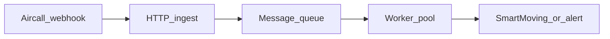

# Royal Moving — CRM gap detector (PoC)

Small **Bun + TypeScript (ESM)** CLI that compares an **Aircall** call transcript to a compact **SmartMoving** opportunity digest, then (when allowed) calls **Claude Haiku 4.5** via the official Anthropic SDK to list **gaps**: facts said on the call that are not reflected in CRM.

Stakeholder-oriented intent is summarized in [`USER_STORIES.md`](USER_STORIES.md).

## Prerequisites

- [Bun](https://bun.sh) installed.
- Install dependencies:

```bash
bun install
```

## Run

From the repository root:

```bash
bun src/detect_gaps.ts aircall_sample_call.json smartmoving_sample_opportunity.json
```

```bash
bun src/detect_gaps.ts aircall_sample_call_outbound.json smartmoving_sample_opportunity_outbound.json
```

Equivalent npm script:

```bash
bun run detect -- aircall_sample_call.json smartmoving_sample_opportunity.json
```

**Stdout** is a single JSON object: `{"findings":[...]}`, **pretty-printed** with indentation (`JSON.stringify(..., null, 2)`). **Stderr** is for everything else: `[INFO]` lines (for example skip reasons, model id, estimated API cost from token usage) and `[ERROR]` / validation details — so pipelines can capture JSON from stdout only.

### Pre-flight behavior (no API spend)

| Condition | Stdout | Stderr (typical) | Exit |
|-----------|--------|------------------|------|
| Transcription missing, `content` missing, `utterances` missing/empty, or no non-empty trimmed `text` | `{"findings":[]}` (pretty) | `[INFO] Skipping LLM: no usable transcript` | `0` |
| `direction === "outbound"` **and** `duration` **&lt;** `filters.shortOutboundMaxDurationSeconds` (default **30**) | `{"findings":[]}` (pretty) | `[INFO] Skipping LLM: outbound duration below threshold …` | `0` |
| LLM path needed but `ANTHROPIC_API_KEY` unset/blank | — | `[ERROR] …` | `1` |

**Inbound** short calls are **not** blanket-skipped: only sub-threshold **outbound** calls are treated as voicemail/no-answer for cost control.

**Example (short outbound — no LLM):**

```bash
echo '{"direction":"outbound","duration":12,"transcription":{"content":{"utterances":[{"speaker":"agent","text":"Hi"}]}}}' > /tmp/short_out.json
bun src/detect_gaps.ts /tmp/short_out.json smartmoving_sample_opportunity.json
```

Stdout (stderr may include `[INFO]` lines):

```json
{
  "findings": []
}
```

## Configuration

### Files

- **`config/default.json`** — committed non-secret defaults (model, thresholds, caps).
- **`config/local.json`** — optional; **gitignored**. Merged **after** `default.json` when you are **not** pointing at a replacement file via `CONFIG_PATH` or `GAP_DETECTOR_CONFIG`.
- **`CONFIG_PATH`** or **`GAP_DETECTOR_CONFIG`** — optional path to a JSON file that **replaces** the primary file read (same schema as `default.json`). When either is set, **`config/local.json` is not merged** (matches the implementation in `src/config.ts`).

### Precedence

`default.json` → optional `local.json` (if allowed) → **environment variables override** any file value.

### Default keys (`config/default.json`)

| Key | Purpose |
|-----|---------|
| `anthropic.model` | Messages API model id |
| `anthropic.maxTokens` | Response budget |
| `anthropic.timeoutMs` | SDK request timeout |
| `filters.shortOutboundMaxDurationSeconds` | Outbound calls shorter than this skip the LLM |
| `shaping.transcriptMaxChars` | Safety cap on shaped transcript length |

### Environment variables

| Variable | Overrides |
|----------|-----------|
| **`ANTHROPIC_API_KEY`** | *(required for LLM path; **environment only** — never put this in JSON)* |
| `CONFIG_PATH` **or** `GAP_DETECTOR_CONFIG` | Primary config file path (replaces `config/default.json` as the base file) |
| `ANTHROPIC_MODEL` | `anthropic.model` |
| `ANTHROPIC_MAX_TOKENS` | `anthropic.maxTokens` (positive integer) |
| `ANTHROPIC_TIMEOUT_MS` | `anthropic.timeoutMs` (positive integer) |
| `SHORT_OUTBOUND_MAX_DURATION_SECONDS` | `filters.shortOutboundMaxDurationSeconds` |
| `TRANSCRIPT_MAX_CHARS` | `shaping.transcriptMaxChars` |

There is **no** `SHORT_CALL_THRESHOLD` alias — use `SHORT_OUTBOUND_MAX_DURATION_SECONDS` so behavior matches [`USER_STORIES.md`](USER_STORIES.md).

Invalid numeric env values fail fast at startup with a clear error.

### Schema validation (Zod)

The PoC validates **Aircall** and **SmartMoving** JSON against narrow Zod schemas for the fields the CLI reads, validates merged **config** JSON, and validates **model output** (`findings`) before writing stdout. Malformed inputs or config produce a non-zero exit and a `prettifyError` summary on stderr; invalid model JSON after the one retry fails the same way. Successful LLM calls log an `[INFO] Estimated API cost: …` line on stderr using the response `usage` field and the Haiku list rates quoted below.

## Prompt design (trade-offs)

- **Token budget vs recall:** The model sees a **shaped transcript** (`agent:` / `external:` lines) and a **CRM digest** built in code (jobs, stops, notes, inventory summary) instead of full raw JSON — cheaper and more consistent than dumping payloads, with a small risk of over-compressing edge fields.
- **Strict JSON vs prose:** The tool asks for **JSON only** and validates `findings` with **Zod**; on parse/validation failure it **retries once** with a corrective instruction, then exits non-zero if still invalid.
- **“Only gaps”:** Instructions emphasize **operational facts stated on the call** that are **missing or contradicted** in CRM, reducing false positives from generic advice.
- **Category taxonomy:** Eleven fixed categories (`HEAVY_ITEMS`, `SPECIAL_HANDLING`, `ACCESS`, …, `OTHER`) keep outputs actionable for routing and UI.
- **Why Haiku for volume:** Haiku 4.5 is the fastest/cheapest tier in Anthropic’s lineup for this generation; see [pricing](https://www.anthropic.com/pricing) and the cost estimate below.

## Sample outputs (stdout)

> **Note:** No `ANTHROPIC_API_KEY` was available in the automation environment, so the JSON below is the **committed reference capture** (same shape as live CLI stdout). With a key, run the sample commands and diff against `outputs/*.json` if you want to compare model drift.

### Inbound pair

`bun src/detect_gaps.ts aircall_sample_call.json smartmoving_sample_opportunity.json`

```json
{
  "findings": [
    {
      "category": "HEAVY_ITEMS",
      "summary": "Customer mentioned a Peloton Bike Plus (~140 lbs) upstairs that is not listed in CRM inventory or heavy-item notes.",
      "quote": "we have this Peloton in the upstairs bedroom that we forgot to tell you about. It's the bigger one, the Bike Plus, I think it weighs around 140 pounds.",
      "confidence": "high"
    },
    {
      "category": "ACCESS",
      "summary": "Destination access uses a rear service entrance off the alley rather than the front entrance; CRM stop notes do not document this routing constraint.",
      "quote": "The building entrance is actually around the back, not the front like Google Maps shows. There's a service entrance off the alley.",
      "confidence": "high"
    },
    {
      "category": "BUILDING_MGMT",
      "summary": "Building requires a COI emailed to the manager at least 48 hours before move-in; CRM digest does not record the COI requirement, recipient email, or deadline.",
      "quote": "they need a Certificate of Insurance, a COI, before move-in day. They were really firm about that. They want it sent to manager@elmtowers.example.com at least 48 hours before.",
      "confidence": "high"
    },
    {
      "category": "ACCESS",
      "summary": "Freight elevator must be reserved between 10 AM and 2 PM and regular elevator is disallowed for movers; CRM elevator field does not capture this reservation window or restriction.",
      "quote": "Second, the freight elevator has to be reserved between 10 am and 2 pm. They won't let movers use the regular elevator at all.",
      "confidence": "high"
    },
    {
      "category": "COMMUNICATION_PREFS",
      "summary": "Point of contact at destination speaks Russian with limited English; CRM notes do not mention language preference for onsite contact.",
      "quote": "my mother-in-law is going to be at the destination to let the crew in. She doesn't speak much English. She speaks Russian mainly.",
      "confidence": "medium"
    },
    {
      "category": "HEAVY_ITEMS",
      "summary": "Customer disclosed a large empty 75-gallon saltwater aquarium to be moved; CRM inventory lists no aquarium or comparable fragile tank item.",
      "quote": "We have a saltwater fish tank, it's a 75 gallon tank. We're going to drain it ourselves but the tank itself, the empty glass tank, do you guys move that?",
      "confidence": "high"
    },
    {
      "category": "PAYMENT",
      "summary": "Agent stated a 3% credit card processing fee on move day; CRM charges and notes do not document that card payments incur an added percentage fee.",
      "quote": "Credit card payment is fine, there's a small processing fee of three percent that gets added on the day of.",
      "confidence": "high"
    }
  ]
}
```

### Outbound pair

`bun src/detect_gaps.ts aircall_sample_call_outbound.json smartmoving_sample_opportunity_outbound.json`

```json
{
  "findings": [
    {
      "category": "ADDRESS_CHANGE",
      "summary": "Customer is moving to a new Glendale condo address with unit 12B; CRM still shows Pasadena as the destination.",
      "quote": "the destination address is different. We were going to move to the place in Pasadena but the deal fell through. We're moving to Glendale instead. The new address is 847 North Brand Boulevard, unit 12B.",
      "confidence": "high"
    },
    {
      "category": "BUILDING_MGMT",
      "summary": "HOA requires a $400 elevator deposit and freight elevator scheduling with weekday-only move hours (9 AM–4 PM); CRM destination stop does not capture deposit, freight rules, or HOA timing constraints.",
      "quote": "the HOA requires us to pay a $400 elevator deposit and we have to schedule the freight elevator. They only allow moves Monday through Friday between 9 am and 4 pm.",
      "confidence": "high"
    },
    {
      "category": "SPECIAL_HANDLING",
      "summary": "Customer disclosed a baby grand piano at the origin (~600 lbs Yamaha); CRM inventory does not list a piano or specialist piano handling.",
      "quote": "we have a baby grand piano. It's been in the family for years. It's at the origin in our living room.",
      "confidence": "high"
    },
    {
      "category": "TIMING",
      "summary": "Customer requested a later arrival window (10–11 AM) due to a morning conflict; CRM still shows 7–8 AM.",
      "quote": "Can we make it a little later? Like 9 or 10 am? My daughter has a soccer game in the morning we want to drop her off at first.",
      "confidence": "high"
    },
    {
      "category": "PAYMENT",
      "summary": "Customer prefers Zelle to avoid the credit card processing fee on a large total; CRM payment preferences do not document Zelle as the intended method.",
      "quote": "you guys take Zelle right? Because the credit card fee you mentioned, three percent, on a five thousand dollar move, that's like a hundred fifty dollars. I'd rather just do Zelle.",
      "confidence": "medium"
    },
    {
      "category": "OTHER",
      "summary": "Customer mentioned a dog allergy concern for crew bringing animals; CRM notes do not capture this preference (low operational risk but was explicitly stated).",
      "quote": "I'm allergic to dogs, so if any of the movers want to bring a service dog or anything, please don't.",
      "confidence": "low"
    }
  ]
}
```

Copies also live under [`outputs/inbound_sample.json`](outputs/inbound_sample.json) and [`outputs/outbound_sample.json`](outputs/outbound_sample.json).

## Cost per 1,000 calls (illustrative)

Using **Claude Haiku 4.5** list pricing from [Anthropic — Pricing](https://www.anthropic.com/pricing) as of **2026-05-09**:

- **Input:** **$1 / million input tokens**
- **Output:** **$5 / million output tokens**

**Rough fixture-based sizing** (system + instructions + call meta + shaped transcript + CRM digest + JSON schema reminder):

- ~**1.2k–1.8k input tokens** per call for these samples (production transcripts may be longer; `TRANSCRIPT_MAX_CHARS` caps risk).
- ~**0.8k–1.5k output tokens** per call when the model returns **6–10** findings with short summaries and quotes.

**Middle estimate:** ~**1.5k** in + ~**1.0k** out per call.

Per **1,000** calls:

- Input: `1.5 × 1000 = 1,500,000` tokens → **1.5 MTok** → **$1.50**
- Output: `1.0 × 1000 = 1,000,000` tokens → **1.0 MTok** → **$5.00**

**≈ $6.50 / 1,000 calls** (order-of-magnitude; rerun with your tokenizer counts and production prompts for budgeting). A large fraction of real traffic can exit early via **empty transcript** or **short outbound** guards at **$0** LLM cost.

## Production Deployment

**Target architecture (not implemented in this PoC).** The repository ships a synchronous CLI over local JSON files. In production, the same pipeline—parse and validate Aircall/SmartMoving shapes, shape the transcript and CRM digest, call the model, validate `findings` with Zod—should live in a **shared library** invoked by **background workers**, not by operators passing file paths. For what the PoC deliberately omits (no CRM write-back, no notifications), see **Non-goals** in [`USER_STORIES.md`](USER_STORIES.md).

### From CLI to event-driven workers

- **Today:** `bun src/detect_gaps.ts <aircall.json> <smartmoving.json>` runs end-to-end in one process.
- **Production:** an **ingress** service accepts webhooks and enqueues work; **consumers** pull messages, fetch fresh CRM state over the network, run the detector, then apply **policy** (update SmartMoving, open a ticket, or notify a channel).

### Target architecture (event-driven)

1. **Trigger:** Configure Aircall (or your telephony layer) to emit a **webhook** when a call is ready for analysis—for example when a call ends **and** transcription is available. The exact event name is a product choice; the important part is not starting gap detection until the transcript is usable.
2. **Ingress:** A small **HTTPS** endpoint (e.g. API Gateway + Lambda, or a container behind a load balancer) **verifies the webhook signature**, normalizes the payload, and returns **2xx quickly**. Heavy work must not block the webhook response, or providers will retry and you will amplify load.
3. **Queue:** Publish a **durable message** (payload or pointer to object storage). **AWS SQS** (with a **dead-letter queue**) fits AWS-native deployments: built-in retries, DLQ, and operational simplicity. **RabbitMQ** is a reasonable alternative when you already run it, need richer routing, or want a portable queue layer across clouds.
4. **Workers:** Horizontally scaled consumers (ECS/Fargate, Lambda with partial batch failure, Kubernetes, etc.) **dequeue**, resolve the SmartMoving opportunity (or internal ID), **fetch the current CRM digest via SmartMoving’s API** (or an internal BFF), then run the same detection path as the CLI to produce `findings`.
5. **Outcomes:** Product policy chooses the side effect:
   - **CRM update:** Patch notes or custom fields through SmartMoving’s API with explicit permissions and an **audit trail**; or
   - **Alert / ticket:** Create a Jira/Linear item, Slack message, or email with links to the opportunity and supporting quotes when human review or safe rollout is required.



### Observability

Split **service health** from **prompt and model quality**; both matter, but they answer different questions.

- **Platform and application (e.g. Datadog or similar):** Distributed traces with a stable **correlation id** (and `call_id` where useful), metrics for **queue depth**, **end-to-end latency**, and **error rates** per stage (ingress, CRM fetch, LLM, downstream notifier). Alert on **DLQ growth**, sustained **429/5xx** from Anthropic or SmartMoving, and worker saturation.
- **Prompts and LLM quality (e.g. LangSmith, Braintrust, or similar):** **Versioned** system and user prompts tied to deployments; offline **evals** on fixtures (golden outputs under [`outputs/`](outputs/) can seed regression baselines); **A/B** comparisons between prompt versions; dashboards for **token usage and cost** per version and per tenant. Human labels or LLM-as-judge can support scoring, with clear governance when judges are themselves LLMs.

### State management and idempotency

Webhooks and queues typically provide **at-least-once** delivery. Handlers must be **idempotent** so retries do not duplicate CRM updates or spam alerts.

- **Idempotency key:** Prefer a natural key such as **`aircall_call_id`** (and, if one call can map to multiple opportunities, include **`smartmoving_opportunity_id`**). If the provider exposes a unique **delivery id**, you can store that as a secondary guard.
- **Durable record:** Before or after successful processing, persist state in **DynamoDB, Postgres, or Redis**—for example `processed_at`, optional **`outcome_fingerprint`** (hash of inputs + prompt version, or of normalized `findings`)—so a duplicate message **no-ops** or performs a safe **upsert** only.
- **Downstream deduplication:** When creating tickets or notifications, use **idempotent APIs** or a stable **external reference** (e.g. ticket keyed by `call_id`) so retries do not open duplicates.

### PII and privacy (US and general compliance)

**Before** sending transcript text to an LLM, run a **pre-LLM redaction pipeline**: pattern matching and, where needed, **NER**-style detection for **payment card numbers**, **SSN**-like sequences, and other sensitive tokens your legal/compliance team defines (sometimes partial redaction of phone or email depending on policy). The PoC does not implement this; production must treat unredacted transcripts as high-risk data.

- **Logging and tracing:** Avoid writing **full raw transcripts** in plaintext logs or exception reports; use **masking**, **sampling**, and **retention limits** aligned with policy.
- **Subprocessors:** Maintain appropriate agreements (e.g. **DPA**) with the model provider; understand **retention** and **training** options for API data and regional constraints if customers require them.

### Additional production checklist

- **Secrets:** API keys and webhook secrets in a managed store (e.g. AWS Secrets Manager), not in config repos.
- **Object storage** for raw payloads when messages should stay small; **versioned prompts** and CI regression on fixtures or snapshots.
- **Retries with backoff** for **429/5xx**; **rate limits** and per-tenant **cost** visibility.
- **Feature flags** for **write-back vs alert-only** rollout.
- **Human review queue** for **`low` confidence** findings and policies beyond this PoC’s fixed category taxonomy.
- **Optional first-stage filter** (rules, embeddings, or a smaller model) before Haiku at very high volume.
- **SmartMoving write-back** with permissions and audit—still **out of scope** for this PoC codebase until explicitly built.

## Typecheck

```bash
bun run typecheck
```

## API key caveat

`ANTHROPIC_API_KEY` must be present in the **environment** whenever the tool needs to call Anthropic. It is **never** read from config files. Without it, the two full sample pairs above will exit with an error after passing transcript and outbound-duration guards.
